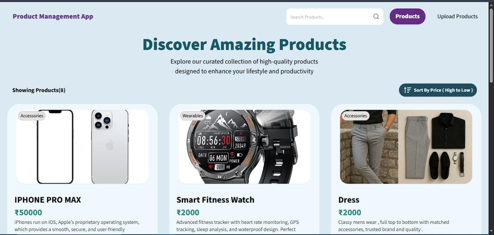
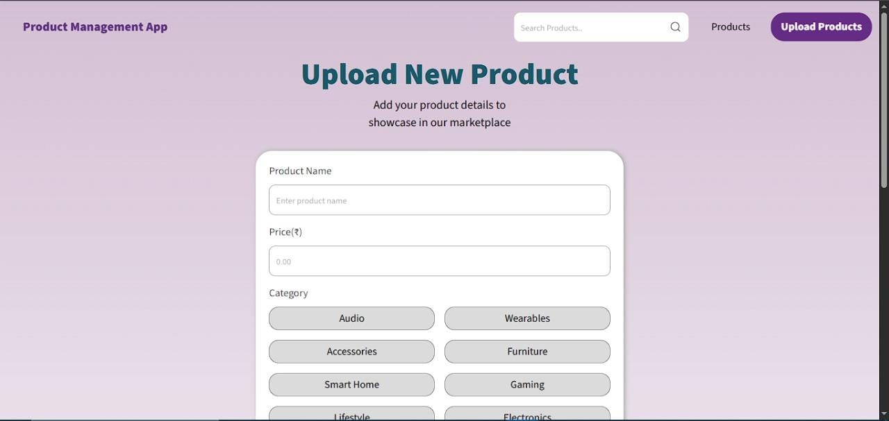
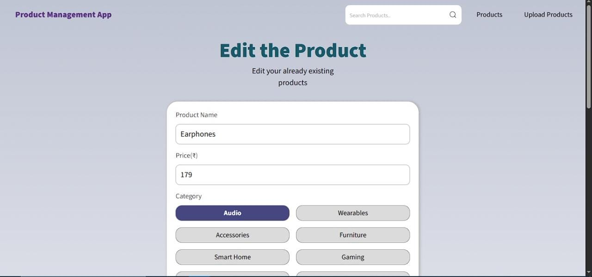
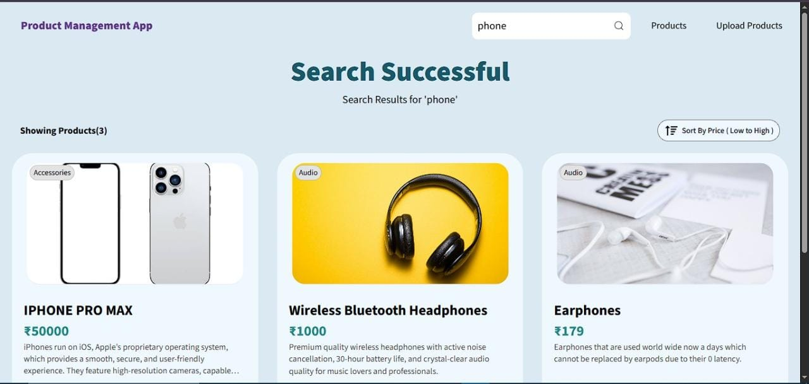

# 📦 Product Management App

A *full-stack Product Management Application* built with the *MERN Stack* (MongoDB, Express.js, React, Node.js).
This project allows users to *upload, edit, search, and manage products* with an intuitive UI and robust backend API.

---

## 🚀 Features

* 📤 *Upload Products* with details like name, brand, price, and category
* ✏ *Edit & Delete Products* with ease
* 🔍 *Search Products* with query support
* 📱 *Responsive Design* (desktop & mobile friendly)
* 📊 Products *sorted by price* automatically
* ⚡ Backend API powered by *Express & MongoDB*
* 🌐 *Deploy-ready* structure (supports Vercel/Netlify for frontend & Render/MongoDB Atlas for backend)

---

## 🛠 Tech Stack

*Frontend:*

* React.js (Vite)
* React Router DOM
* Axios
* Custom CSS

*Backend:*

* Node.js
* Express.js
* MongoDB Atlas
* Mongoose
* Multer (optional, for file uploads)
* dotenv

---

## 📂 Project Structure

ProductManagementApp/
│
├── backend/              # Express.js + MongoDB backend
│   ├── models/           # Mongoose schemas
│   ├── routes/           # API routes
│   ├── controllers/      # Business logic
│   ├── .env              # Environment variables (ignored in git)
│   └── server.js         # Backend entry point
│
├── frontend/             # React frontend
│   ├── src/
│   │   ├── components/   # Navbar, Footer, UI components
│   │   ├── pages/        # Products, Upload, Edit, Search, Error
│   │   └── App.jsx       # Main app file
│   ├── .env              # Environment variables (ignored in git)
│   └── public/
│
├── .gitignore            # Ignore node_modules & .env
├── README.md             # Project documentation

---

## ⚙ Installation & Setup

### 1️⃣ Clone the Repository

bash
git clone https://github.com/29Anirudh/ProductManagement.git
cd ProductManagement

### 2️⃣ Backend Setup

bash
cd backend
npm install
npm start   # or nodemon server.js (if nodemon is installed)

### 3️⃣ Frontend Setup

bash
cd ../frontend
npm install
npm run dev

### 4️⃣ Environment Variables

Create .env files in both backend/ and frontend/.

**Backend .env**

env
PORT=5000
MONGO_URI=your_mongodb_atlas_uri

**Frontend .env**

env
VITE_API_URL=http://localhost:5000

---

## 📸 Screenshots / Demo

### 🔹 Home Page

### 🔹 Upload Product

### 🔹 Edit Product

### 🔹 Search Products

---

## 🚀 Deployment

* *Frontend:* Vercel 
* *Backend:* Render 
* *Database:* MongoDB Atlas

---

## 🤝 Contributing

Contributions are welcome!

* Fork the repo
* Create a feature branch
* Submit a pull request 🚀

---

## 📜 License

This project is licensed under the *MIT License*.

---